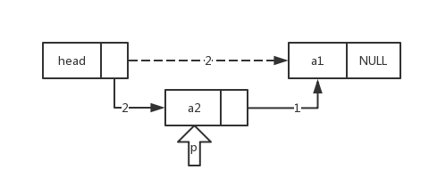
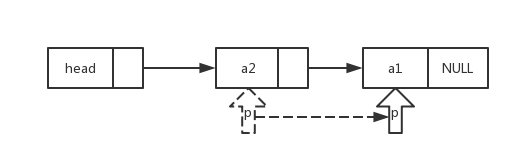
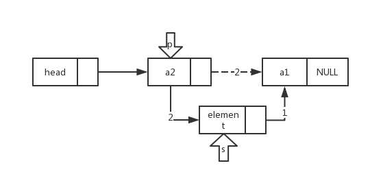
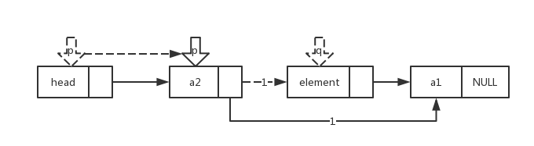
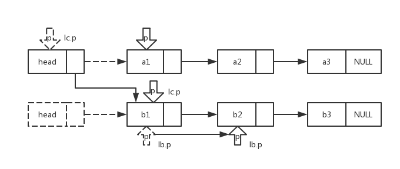

#Singly Linked List
##LinkedList()

##LinkedList(int n)


```c++
p = new LNode(num);
p -> next = head -> next;
head -> next = p;
```
##getData(int i)


```c++
while(p && j<i){
	p = p->next;
	++j;
}
```
##insertNode(int i, int element)


```c++
s -> data = element;
s -> next = p -> next;
p -> next = s;
```
##deleteNode(int i, int &element)


```c++
q = p -> next;
p -> next = q -> next;
element = q -> data;
delete q;
```
##mergeList(LinkedList &la, LinkedList &lb)


```c++
lc.p ->next = lb.p;
lc.p = lb.p;
lb.p = lc.p -> next;
```